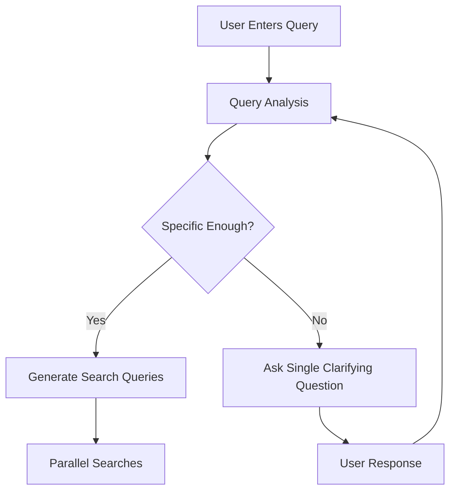
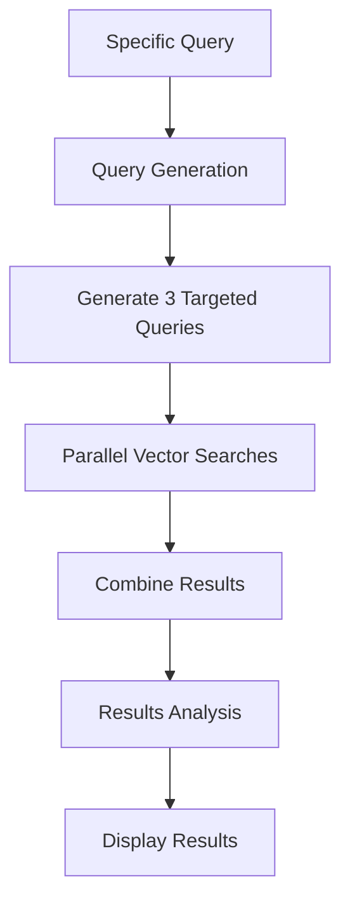
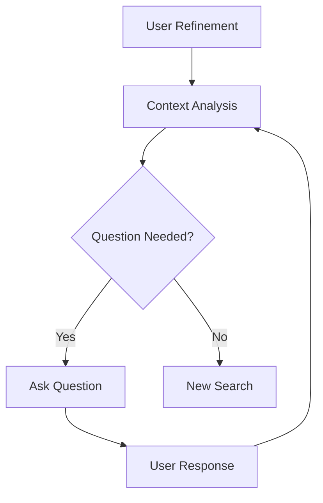

# Chat and Search System Flow

## Overview

The system implements an intelligent chat-based interface for technology transfer and patent search. It uses a combination of LLM-powered analysis and vector search to help users find relevant technologies through an iterative refinement process. The system employs multiple targeted searches to ensure comprehensive coverage of the technology space.

## Components

1. **User Interface (`ChatResults.tsx`)**
   - Displays chat messages, search results, and handles user input
   - Shows multiple search queries and their explanations
   - Manages loading states and error handling
   - Renders markdown-formatted responses
   - Provides a fixed-position chat input for refinements

2. **System Prompts (`prompts.ts`)**
   - `queryAnalysis`: Guides initial query understanding (single clarification)
   - `searchQueryGeneration`: Creates multiple targeted search queries
   - `resultAnalysis`: Structures search result analysis
   - `refinementAnalysis`: Manages follow-up questions and refinements

3. **API Endpoints**
   - `/api/chat`: Handles LLM interactions
   - `/api/search`: Manages vector search in Pinecone

## Flow Sequence

### 1. Initial Query Processing



1. User submits initial query
2. System sends query to LLM with `queryAnalysis` prompt
3. LLM evaluates query specificity:
   - If not specific: Asks ONE clarifying question
   - If specific: Proceeds to query generation

### 2. Search Process



1. LLM generates up to 3 targeted search queries
2. Each query focuses on different aspects:
   - Different technical terminology
   - Alternative approaches
   - Various applications
3. System performs parallel searches
4. Results are combined and analyzed
5. Display shows:
   - Search queries with explanations
   - Analysis summary
   - Top 10 most relevant results across all searches

### 3. Search Query Generation

```json
{
  "queries": [
    {
      "query": "Advanced battery recycling methods lithium ion",
      "explanation": "Focus on current recycling technologies for Li-ion batteries"
    },
    {
      "query": "Novel lithium battery material recovery processes",
      "explanation": "Explore innovative methods for valuable material extraction"
    },
    {
      "query": "Sustainable battery waste management solutions",
      "explanation": "Address environmental aspects of battery recycling"
    }
  ]
}
```

### 4. Refinement Loop



1. User enters refinement
2. System includes:
   - Previous messages
   - Original query
   - New refinement
3. LLM analyzes with `refinementAnalysis` prompt
4. Process continues until user finds desired information

## Message Types

1. **User Messages**
   - Right-aligned
   - Purple background
   - Contains user queries and refinements

2. **System Messages**
   - Left-aligned
   - Gray background
   - Contains:
     - Clarifying questions
     - Search status updates
     - Analysis explanations

3. **Result Messages**
   - Left-aligned
   - Light purple background
   - Contains:
     - Analysis summary
     - Result cards with details

## Error Handling

1. **API Failures**
   - Chat errors: Prompt user to retry
   - Search errors: Display error toast
   - Network issues: Show appropriate error messages

2. **Input Validation**
   - Empty queries prevented
   - Loading states managed
   - Duplicate requests prevented

## Technical Implementation Details

### State Management
```typescript
interface SearchQuery {
  query: string;
  explanation: string;
}

interface Message {
  type: 'user' | 'system' | 'result';
  content: string;
  searchQueries?: SearchQuery[];
  results?: SearchResult[];
}
```

### Search Results
```typescript
interface SearchResult {
  title: string;
  university: string;
  description: string;
  patents: string;
  llm_summary: string;
  llm_teaser: string;
  score: number;
}
```

### LLM Integration
- Uses OpenAI's API
- Maintains conversation context
- Structured prompts for consistent responses

### UI Components
- Fixed header with back navigation
- Scrollable chat area
- Fixed input bar at bottom
- Responsive design for all screen sizes

## Best Practices

1. **Query Formulation**
   - Be specific about technology domain
   - Include application context
   - Specify technical requirements

2. **Refinement Strategy**
   - Build on previous results
   - Focus on specific aspects
   - Use clear, concise language

3. **Result Interpretation**
   - Review complete result set
   - Consider related technologies
   - Follow suggested next steps

## Performance Considerations

1. **Optimization**
   - Message batching
   - Efficient scroll handling
   - Markdown rendering optimization

2. **Response Times**
   - LLM processing: 2-5 seconds
   - Vector search: 1-2 seconds
   - UI updates: Immediate

3. **Resource Usage**
   - Client-side memory management
   - Efficient state updates
   - Proper cleanup on unmount 