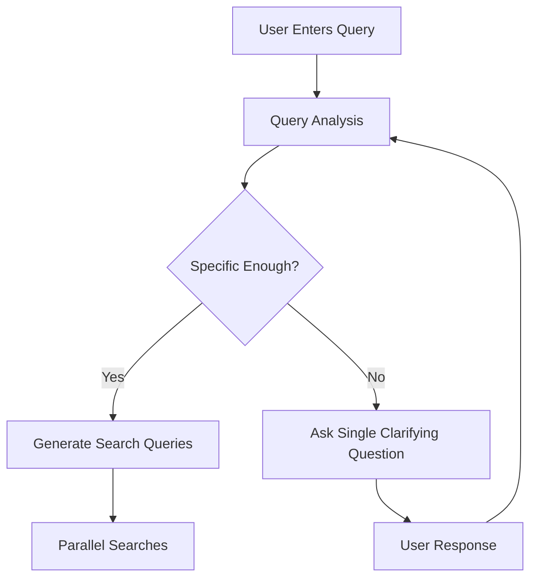
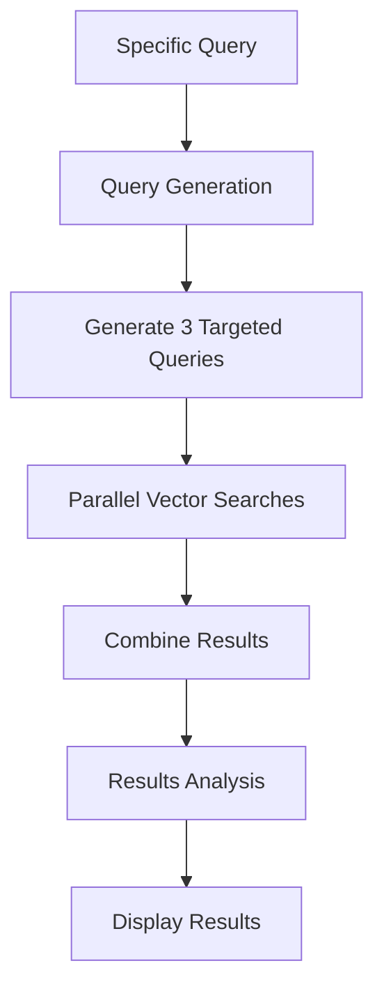
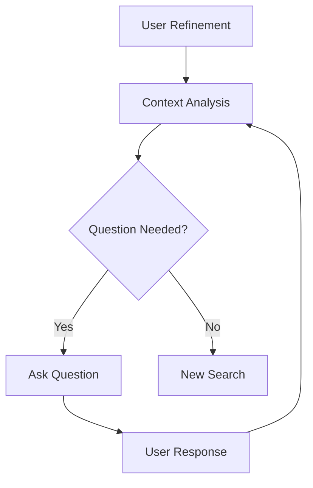
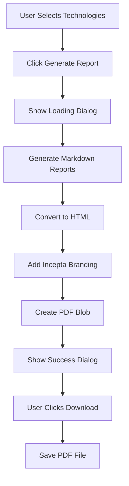
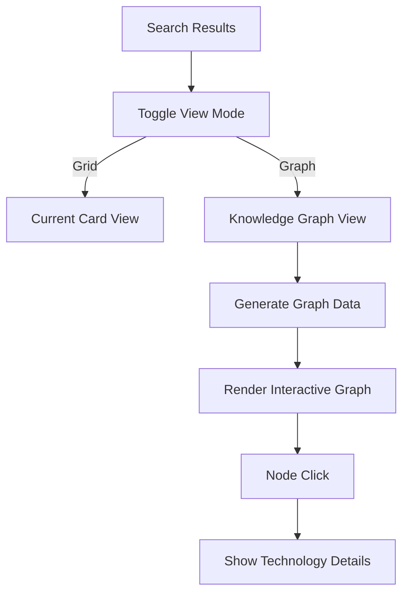

# Chat and Search System Flow

## Overview

The system implements an intelligent chat-based interface for technology transfer and patent search. It uses a combination of LLM-powered analysis and vector search to help users find relevant technologies through an iterative refinement process. The system employs multiple targeted searches to ensure comprehensive coverage of the technology space.

## Components

1. **User Interface (`ChatResults.tsx`)**
   - Displays chat messages, search results, and handles user input
   - Shows multiple search queries and their explanations
   - Manages loading states and error handling
   - Renders markdown-formatted responses
   - Provides a fixed-position chat input for refinements
   - Handles PDF report generation and download
   - Toggleable knowledge graph visualization of results

2. **System Prompts (`prompts.ts`)**
   - `queryAnalysis`: Guides initial query understanding (single clarification)
   - `searchQueryGeneration`: Creates multiple targeted search queries
   - `resultAnalysis`: Structures search result analysis
   - `refinementAnalysis`: Manages follow-up questions and refinements
   - `reportGeneration`: Formats technology details into structured markdown reports
   - `graphAnalysis`: Identifies relationships between technologies

3. **API Endpoints**
   - `/api/chat`: Handles LLM interactions
   - `/api/search`: Manages vector search in Pinecone

## Flow Sequence

### 1. Initial Query Processing



1. User submits initial query
2. System sends query to LLM with `queryAnalysis` prompt
3. LLM evaluates query specificity:
   - If not specific: Asks ONE clarifying question
   - If specific: Proceeds to query generation

### 2. Search Process



1. LLM generates up to 3 targeted search queries
2. Each query focuses on different aspects:
   - Different technical terminology
   - Alternative approaches
   - Various applications
3. System performs parallel searches
4. Results are combined and analyzed
5. Display shows:
   - Search queries with explanations
   - Analysis summary
   - Top 10 most relevant results across all searches

### 3. Search Query Generation

```json
{
  "queries": [
    {
      "query": "Advanced battery recycling methods lithium ion",
      "explanation": "Focus on current recycling technologies for Li-ion batteries"
    },
    {
      "query": "Novel lithium battery material recovery processes",
      "explanation": "Explore innovative methods for valuable material extraction"
    },
    {
      "query": "Sustainable battery waste management solutions",
      "explanation": "Address environmental aspects of battery recycling"
    }
  ]
}
```

### 4. Refinement Loop



1. User enters refinement
2. System includes:
   - Previous messages
   - Original query
   - New refinement
3. LLM analyzes with `refinementAnalysis` prompt
4. Process continues until user finds desired information

### 5. Report Generation Process



1. User selects technologies using star icons
2. Clicks "Generate Report" button
3. System shows loading dialog with spinner
4. For each selected technology:
   - Sends data to LLM with `reportGeneration` prompt
   - Receives formatted markdown
5. Combines all reports with separators
6. Converts markdown to HTML with styling:
   - Incepta logo and branding
   - Professional typography
   - Section formatting
7. Generates PDF blob
8. Shows success dialog with download button
9. User downloads the report

### Report Structure

```markdown
# [Technology Title]

## University
[University Name]

## Link
[Technology URL]

## Summary
[2-3 sentences describing the core technology]

## Applications
[Bullet points of key applications]

## Problem Solved
[1-2 paragraphs explaining the solution]

## Stage of Development
[Current development stage]

## IP Status
[Patent and licensing status]
```

### 6. Knowledge Graph Visualization



1. User toggles between grid and graph views
2. System processes technology relationships:
   - Technical domains
   - Universities/Institutions
   - Application areas
   - Problem spaces
3. Renders interactive graph:
   - Technologies as nodes
   - Relationships as edges
   - Color coding by category
   - Size based on relevance
4. Interactive features:
   - Zoom and pan
   - Node selection
   - Relationship highlighting
   - Details on demand

### Graph View Structure

```typescript
interface GraphNode {
  id: string;
  label: string;
  type: 'technology' | 'domain' | 'university' | 'application';
  data: SearchResult | null; // Full data for technology nodes
  size: number; // Based on relevance score
  color: string; // Based on type
}

interface GraphEdge {
  source: string;
  target: string;
  type: 'belongs_to' | 'related_to' | 'applies_to';
  weight: number; // Relationship strength
}

interface GraphData {
  nodes: GraphNode[];
  edges: GraphEdge[];
}
```

## Message Types

1. **User Messages**
   - Right-aligned
   - Purple background
   - Contains user queries and refinements

2. **System Messages**
   - Left-aligned
   - Gray background
   - Contains:
     - Clarifying questions
     - Search status updates
     - Analysis explanations

3. **Result Messages**
   - Left-aligned
   - Light purple background
   - Contains:
     - Analysis summary
     - Result cards with details

## Error Handling

1. **API Failures**
   - Chat errors: Prompt user to retry
   - Search errors: Display error toast
   - Network issues: Show appropriate error messages

2. **Input Validation**
   - Empty queries prevented
   - Loading states managed
   - Duplicate requests prevented

## Technical Implementation Details

### State Management
```typescript
interface SearchQuery {
  query: string;
  explanation: string;
}

interface Message {
  type: 'user' | 'system' | 'result';
  content: string;
  searchQueries?: SearchQuery[];
  results?: SearchResult[];
}

// PDF Generation States
const [isGeneratingPDF, setIsGeneratingPDF] = useState(false);
const [generatedPDFBlob, setGeneratedPDFBlob] = useState<Blob | null>(null);
```

### Search Results
```typescript
interface SearchResult {
  title: string;
  university: string;
  description: string;
  patents: string;
  llm_summary: string;
  llm_teaser: string;
  score: number;
}
```

### LLM Integration
- Uses OpenAI's API
- Maintains conversation context
- Structured prompts for consistent responses

### UI Components
- Fixed header with back navigation
- Scrollable chat area
- Fixed input bar at bottom
- Responsive design for all screen sizes

### PDF Generation Flow
```typescript
const generatePDF = async () => {
  setIsGeneratingPDF(true);
  
  // 1. Generate markdown
  const markdown = await generateReportMarkdown(selectedResults);
  
  // 2. Convert to HTML
  const html = marked(markdown);
  
  // 3. Add styling and branding
  const styledHtml = `...`;
  
  // 4. Generate PDF blob
  const pdf = await html2pdf().set(options).from(element).output('blob');
  
  setGeneratedPDFBlob(pdf);
  setIsGeneratingPDF(false);
};

const downloadPDF = () => {
  // Create and trigger download
  const url = window.URL.createObjectURL(generatedPDFBlob);
  const link = document.createElement('a');
  link.download = 'technology-report.pdf';
  link.href = url;
  link.click();
};
```

### View Modes
```typescript
type ViewMode = 'grid' | 'graph';
const [viewMode, setViewMode] = useState<ViewMode>('grid');

// Graph state
interface GraphState {
  nodes: GraphNode[];
  edges: GraphEdge[];
  selectedNode: string | null;
  highlightedNodes: Set<string>;
}
```

### Graph Generation
```typescript
const generateGraphData = (results: SearchResult[]): GraphData => {
  const nodes: GraphNode[] = [];
  const edges: GraphEdge[] = [];
  
  // Create technology nodes
  results.forEach(result => {
    nodes.push({
      id: result.id,
      label: result.title,
      type: 'technology',
      data: result,
      size: result.score * 10,
      color: '#6B46C1'
    });
    
    // Add university node and edge
    const universityId = `uni-${result.university}`;
    if (!nodes.find(n => n.id === universityId)) {
      nodes.push({
        id: universityId,
        label: result.university,
        type: 'university',
        data: null,
        size: 8,
        color: '#4B0082'
      });
    }
    edges.push({
      source: result.id,
      target: universityId,
      type: 'belongs_to',
      weight: 1
    });
  });
  
  return { nodes, edges };
};
```

## Best Practices

1. **Query Formulation**
   - Be specific about technology domain
   - Include application context
   - Specify technical requirements

2. **Refinement Strategy**
   - Build on previous results
   - Focus on specific aspects
   - Use clear, concise language

3. **Result Interpretation**
   - Review complete result set
   - Consider related technologies
   - Follow suggested next steps

4. **Report Generation**
   - Select relevant technologies
   - Review generated content
   - Save reports for reference

5. **Graph Visualization**
   - Use clear visual hierarchy
   - Implement smooth transitions
   - Provide intuitive interactions
   - Maintain responsive performance

## Performance Considerations

1. **Optimization**
   - Message batching
   - Efficient scroll handling
   - Markdown rendering optimization
   - PDF generation in background
   - Graph layout computation
   - WebGL rendering for large graphs

2. **Response Times**
   - LLM processing: 2-5 seconds
   - Vector search: 1-2 seconds
   - UI updates: Immediate
   - PDF generation: 5-15 seconds
   - Graph layout: 1-3 seconds

3. **Resource Usage**
   - Client-side memory management
   - Efficient state updates
   - Proper cleanup on unmount
   - PDF blob cleanup after download
   - Graph memory optimization
   - WebGL context management 